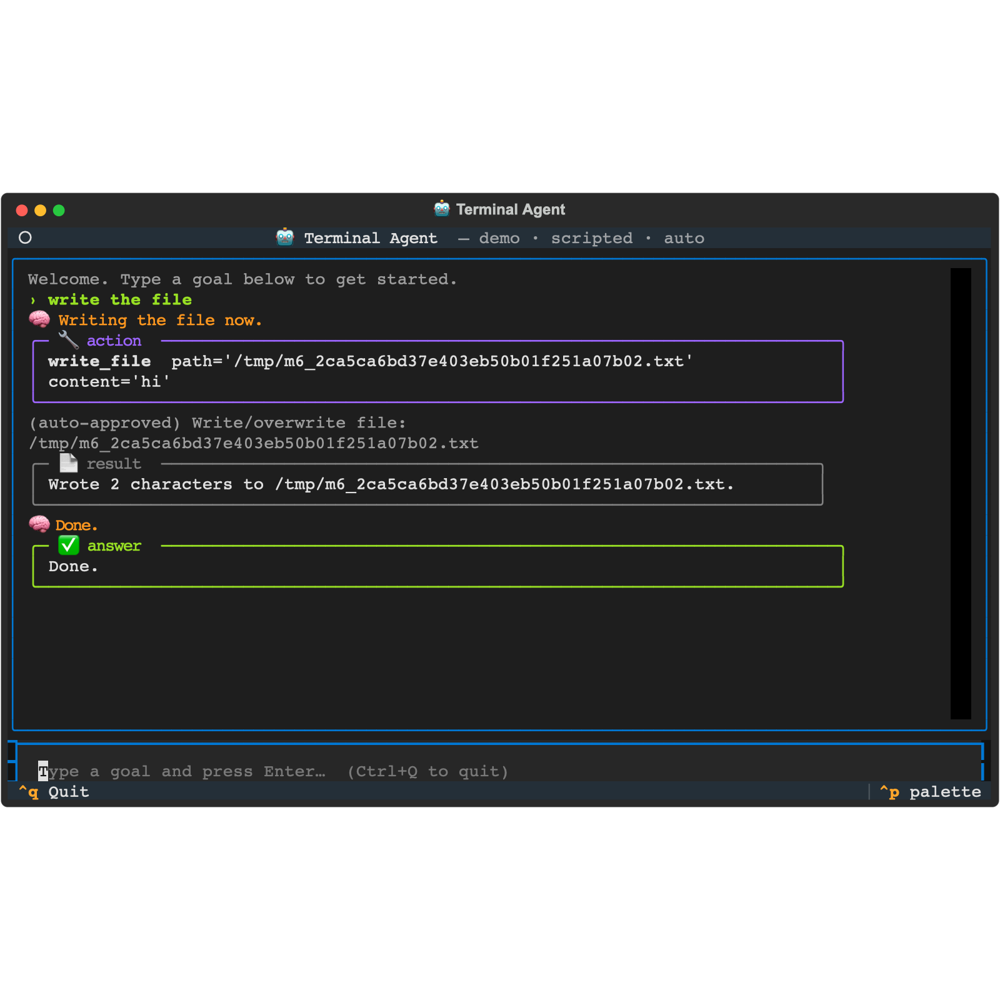
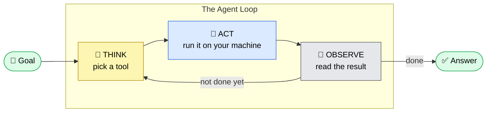
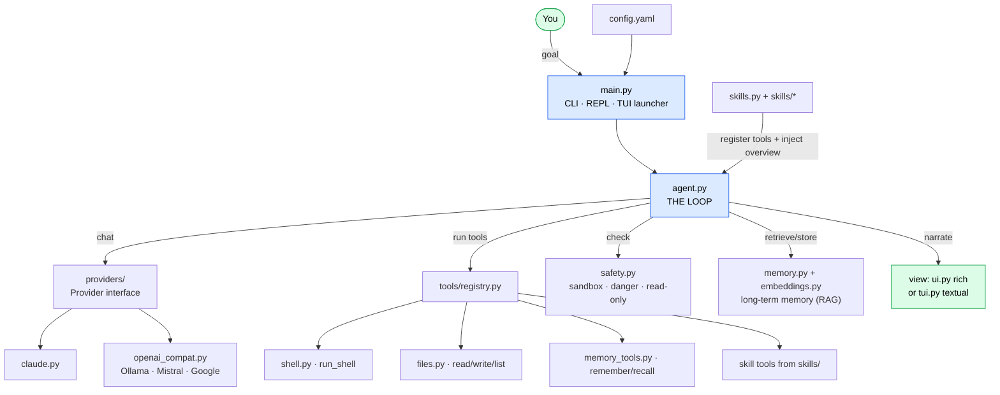
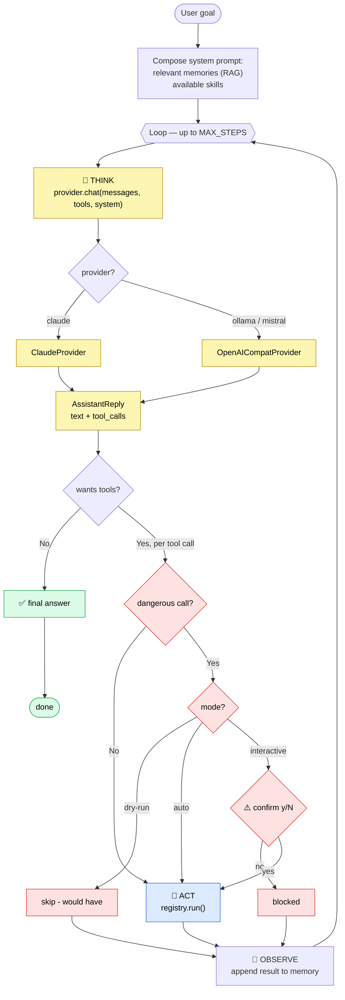
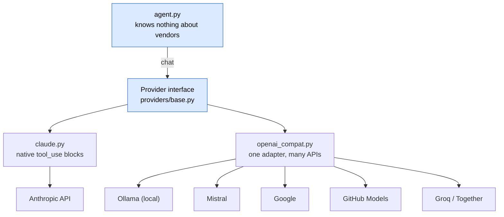
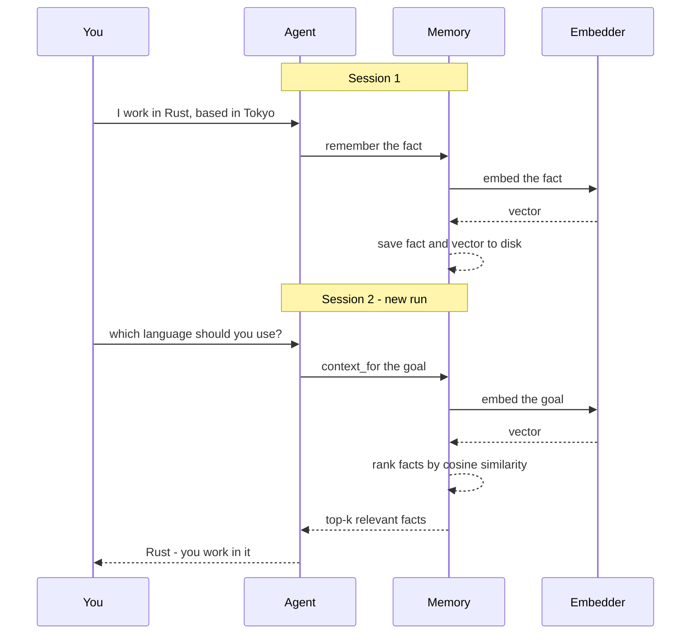
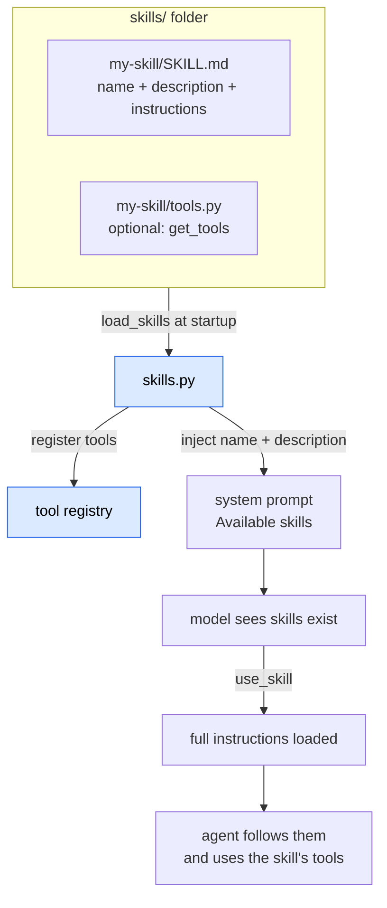

# 🤖 Terminal Agent

A terminal AI agent that **operates your computer** — it runs shell commands,
reads and writes files, remembers what it learns about you, and completes
multi-step tasks through a *think → act → observe* loop. It works with **local
models (Ollama, free)** or **Claude**, is **extensible with skills**, and ships
with a full-screen UI.

> Built as a portfolio project to demonstrate practical AI engineering: the agent
> loop, tool use, a provider-agnostic adapter layer, retrieval-augmented memory
> (RAG), human-in-the-loop safety, a skills/plugin system, and a Textual UI.



---

## Table of contents

- [What makes it "agentic"](#what-makes-it-agentic)
- [Highlights](#highlights)
- [Architecture](#architecture)
- [How a turn flows](#how-a-turn-flows)
- [Multi-provider abstraction](#multi-provider-abstraction)
- [Memory and semantic recall (RAG)](#memory-and-semantic-recall-rag)
- [Skills — extend the agent](#skills--extend-the-agent)
- [Execution modes and safety](#execution-modes-and-safety)
- [Quick start](#quick-start)
- [Usage](#usage)
- [Configuration](#configuration)
- [Project layout](#project-layout)
- [Testing](#testing)
- [Roadmap](#roadmap)

---

## What makes it "agentic"

It's not a chatbot. Given a goal, the agent runs a loop — and that loop is the
whole idea:



A plain LLM call is just `Goal -> Answer`. The **loop** — the model choosing a
tool, the code running it, the result feeding back — is what lets the agent take
multiple steps on your machine until the job is actually done. It lives in
[`agent.py`](agent.py), about 40 lines.

## Highlights

- **Operates the real machine** — tools for shell, file read/write, and listing.
- **Multi-provider** — Claude, Ollama (local), Mistral, Google, GitHub Models,
  Groq, Together via one OpenAI-compatible adapter plus a dedicated Claude adapter.
- **Long-term memory with semantic recall (RAG)** — curated facts persist to
  disk; the most relevant ones are retrieved into each session by meaning.
- **Skills** — drop a folder in `skills/` to teach the agent new playbooks and
  give it new tools, without touching the core code.
- **Safety first** — a path sandbox, destructive-command detection, and a human
  confirmation gate.
- **Three execution modes** — interactive, `--auto` (autonomous), and
  `--dry-run` (preview; guaranteed to change nothing, even vs. shell tricks).
- **Two UIs** — a `rich` terminal view and a full-screen `textual` app (`--tui`).

---

## Architecture

Every box below is one small, single-purpose file. The agent loop talks to
abstractions (a provider interface, a tool registry, a memory store, a view), so
each part can change independently.



## How a turn flows

The full path of a single turn, including the safety gate and execution modes:



---

## Multi-provider abstraction

The agent never imports `anthropic` or `openai` directly. It speaks **one common
language** — `provider.chat(messages, tools, system)` — and a small adapter
translates that to each vendor's API. Swapping the model is a one-line config
change.



Most providers (Mistral, Google, GitHub Models, Groq, Together, local Ollama)
expose an **OpenAI-compatible** endpoint, so one adapter covers them all — you
just change `base_url`. Claude gets its own adapter because its tool-use format
differs (and is excellent). See [`providers/`](providers/).

## Memory and semantic recall (RAG)

Two tiers, on purpose:

| Tier | What | Lifetime |
| --- | --- | --- |
| **Short-term** | the conversation (`messages`) | one run |
| **Long-term** | curated facts in `agent_memory.json` | forever |

The agent curates its own long-term memory with a `remember` tool, storing
**distilled facts** ("User's projects live in ~/code"), not raw transcripts. At
the start of each session, the facts most relevant to the current goal are
retrieved by meaning (embeddings + cosine similarity) and injected into the
prompt — this is the RAG step.



If embeddings aren't available (model not pulled, disabled), recall falls back to
keyword search automatically — the agent never breaks. Run
`ollama pull nomic-embed-text` once to enable semantic recall. See
[`memory.py`](memory.py) and [`embeddings.py`](embeddings.py).

## Skills — extend the agent

A **skill** is a drop-in folder that teaches the agent a playbook for a task and
can ship its own Python tools — no core-code changes. The agent always sees each
skill's one-line description; it loads the full instructions on demand
(progressive disclosure) via the `use_skill` tool.



### How to add a skill

Create a folder under `skills/`:

```
skills/
  my-skill/
    SKILL.md      # required
    tools.py      # optional
```

`SKILL.md` — frontmatter plus instructions:

```markdown
---
name: my-skill
description: One specific line — shown to the agent so it knows when to use this.
---

# Instructions

Step-by-step guidance the agent follows once it loads this skill.
```

`tools.py` (optional) — ship Python tools:

```python
from tools.registry import Tool

def get_tools(context):
    sandbox = context.get("sandbox")   # shared services from the host

    def my_action(path: str) -> str:
        if sandbox and not sandbox.is_allowed(path):
            return "Blocked: outside the sandbox."
        ...                              # do the work
        return "result string"

    return [Tool(
        name="my_action",
        description="What it does — the agent reads this to decide to call it.",
        parameters={"type": "object",
                    "properties": {"path": {"type": "string", "description": "..."}},
                    "required": ["path"]},
        func=my_action,
        # dangerous=True,                # routed through the confirmation gate
    )]
```

That's it — restart the agent and the skill is live. Two examples ship in
[`skills/`](skills/): **`text-stats`** (instructions plus a custom tool) and
**`git-helper`** (instructions only). Full guide: [`skills/README.md`](skills/README.md).

## Execution modes and safety

Three layers of safety:

1. **Path sandbox** — file tools may only touch folders in `allowed_paths`.
2. **Destructive-command detection** — `rm`, `mv`, `git push`, redirects, etc.
3. **Human confirmation gate** — dangerous actions ask before running.

…and three **modes** that decide what the gate does:

| Mode | Flag | Dangerous action behavior |
| --- | --- | --- |
| Interactive | *(default)* | Ask the user `y/N` |
| Autonomous | `--auto` | Run without asking |
| Preview | `--dry-run` | **Never execute** — report what it would do |

`--dry-run` is hardened: it blocks not just `write_file` but **any shell command
that isn't provably read-only**, so a model can't sneak a `touch`/`tee`/`cat >`
past it. "No changes" really means no changes.

---

## Quick start

Free and local — no API key:

1. **Install [Ollama](https://ollama.com)** and pull models:
   ```bash
   ollama pull qwen3.5            # the "brain" (any tool-capable model works)
   ollama pull nomic-embed-text  # embeddings for semantic memory (optional)
   ```
2. **Install dependencies:**
   ```bash
   pip install -r requirements.txt
   ```
3. **Run it:**
   ```bash
   python main.py            # interactive
   python main.py --tui      # full-screen UI
   ```

### Use Claude instead

```bash
export ANTHROPIC_API_KEY=sk-ant-...
```
then in `config.yaml`: `provider: claude`, `model: claude-opus-4-8`. Same agent,
sharper brain.

## Usage

```bash
python main.py                          # interactive REPL
python main.py --tui                    # full-screen Textual UI
python main.py "organize my downloads"  # one-shot: run a goal, then exit
python main.py --auto "..."             # autonomous: no confirmation prompts
python main.py --dry-run "..."          # preview only — changes nothing
python main.py --provider claude --model claude-opus-4-8 "..."   # override config
```

## Configuration

`config.yaml`:

| Key | Meaning |
| --- | --- |
| `provider` | `ollama`, `claude`, `mistral`, `google`, `github`, `groq` |
| `model` | Model name in that provider's naming |
| `base_url` | Endpoint for OpenAI-compatible providers |
| `api_key` | Provider key (or use env: `ANTHROPIC_API_KEY` / `AGENT_API_KEY`) |
| `allowed_paths` | Folders the agent may operate in (the sandbox) |
| `confirm_dangerous` | Ask before destructive actions (default `true`) |
| `memory_file` | Where long-term memory is stored |
| `embed_model` | Embedding model for semantic recall (`""` = keyword mode) |
| `skills_dir` | Folder of user skills |

## Project layout

```
main.py          entry point — CLI, REPL, TUI launcher
agent.py         THE LOOP (think -> act -> observe)
config.yaml      provider / model / sandbox / memory / skills
safety.py        sandbox · danger detection · read-only classifier
memory.py        long-term memory store (two-tier)
embeddings.py    vector embeddings for semantic recall (+ keyword fallback)
skills.py        load and register user skills
ui.py            rich terminal view
tui.py           full-screen Textual app (--tui)
providers/       base.py · openai_compat.py · claude.py
tools/           registry.py · shell.py · files.py · memory_tools.py
skills/          user-added skills (text-stats, git-helper, and your own)
docs/            screenshots
```

## Testing

Every milestone was verified with scripted tests (the agent loop driven by fake
providers) and real end-to-end runs against local Ollama — including deliberate
edge cases: dry-run blocking `rm -rf` and shell-based file-creation tricks,
semantic recall rejecting unrelated queries, graceful provider-failure exits,
broken skills being skipped, and the cross-thread TUI confirm modal.

## Roadmap

- [x] **M1** — the loop + `run_shell` + Ollama/Claude adapters
- [x] **M2** — file tools (read/write/list) + sandbox path enforcement
- [x] **M3** — long-term memory: `remember`/`recall` + per-session injection
- [x] **M4** — semantic recall: embeddings + cosine similarity + keyword fallback
- [x] **M5** — execution modes (`--auto`, `--dry-run`) + one-shot CLI + overrides
- [x] **M6** — skills system + full-screen Textual UI
- [ ] **next** — more built-in skills, conversation persistence, a web UI

---

*Built with the Claude API patterns, local Ollama models, `rich`, and `textual`.*
